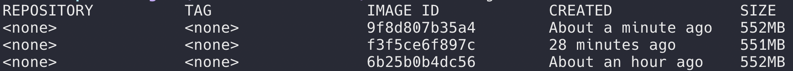

## 遵循以下几项原则：

+ 1）使用最小基础镜像

用于打包编译前端代码的镜像 `node:alpine` 是 75M 左右，而用于生成最终镜像的 `nginx:alpine` 仅 16M 左右（多阶段构建）。

+ 2）多阶段构建

我们最终需要的仅仅是打包之后的静态文件和一个 nginx 服务器，并不需要 node 环境、 node_modules 文件夹和源码，而且通常 node_modules 文件夹会占据相当大的空间，少则几百 M 多则 1 G，如果把不需要的文件放到构建镜像中实属浪费。

这种情况下就可以使用多阶段构建的方式，将整个过程两个阶段：第一阶段是在 node 环境中对源码打包编译，第二阶段将上一阶段中编译出来的文件放入一个纯净的 nginx 环境。

+ 3）缓存 node modules

安装 npm 依赖是整个构建过程中非常耗时的一个步骤，而且在依赖没有发生变化的情况下，也不需要每次构建时都重新安装。

在拷贝整个项目源码之前，将 `package.json` 单独拷贝到镜像中，然后执行 `npm install` 操作，这样可以有效利用 docker 都缓存功能，节省构建时间。

## 使用

假设本次构建的镜像名称为 front，标签为 v0.1

+ **构建镜像**

```bash
docker build -t front:v0.1 .
```

+ **后台运行容器**

```bash
docker run -d -p 8000:80 front:v0.1
```

## 其他

多阶段构建会产生一些名称和标签都为 `none` 的 image，如下：



这是镜像构建过程中第一阶段产生的镜像，可以作为以后再次构建镜像的缓存，不建议删除。

当然，如果真的想要删除掉它们，可以用下面命令进行删除：

```bash
docker stop $(docker ps -a | grep "Exited" | awk '{print $1 }')

docker rm $(docker ps -a | grep "Exited" | awk '{print $1 }')

docker rmi $(docker images | grep "none" | awk '{print $3}')
```


